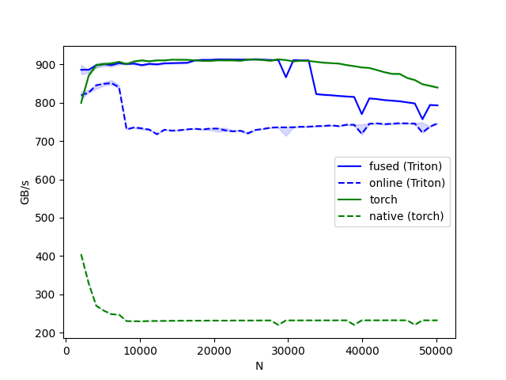

# Record

In the 2080Ti GPU Platform

#### Softmax

#### Flash Attention

| Implementation |  Speed Up | 
| -------------- | --------- |
| Pytorch Spec  | 1x        |
| 2-Pass Impl    | 3.5x      |
| 1-Pass Impl    | 4.35x     |

- [ ] Flash Attention with tiling
- [ ] TODO: Add More test to measure performance

#### 2D-Convolution

## Reference 

https://github.com/srush/Triton-Puzzles

https://github.com/SiriusNEO/Triton-Puzzles-Lite